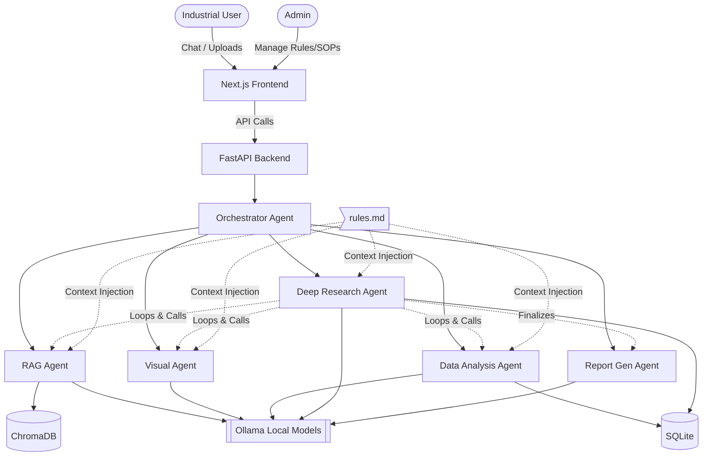

# Sovereign On-Premise Agentic AI Workbench

This is a local, on-premise AI Workbench designed for confidential industrial work. It features multiple specialized agents (RAG, Data Analysis, Visual, Orchestrator, Deep Research) that run completely locally without external APIs.

## Technology Stack
- **Frontend:** Next.js, Tailwind CSS
- **Backend:** Python FastAPI, LangGraph
- **Local Inference:** Ollama (Llama 3 8B, Phi-3, LLaVA)
- **Databases:** SQLite (Relational), ChromaDB (Vector)

## Setup Instructions for Developers

### 1. Prerequisites
- [Node.js](https://nodejs.org/) (for frontend)
- [Python 3.10+](https://www.python.org/) (for backend)
- [Ollama](https://ollama.com/) (for running local AI models)

### 2. Local AI Setup
Install Ollama and pull the required models:
```bash
ollama run llama3:8b
# (Optional) ollama run llava
```

### 3. Backend Setup
```bash
cd backend
python -m venv venv
# Windows: venv\Scripts\activate
# Mac/Linux: source venv/bin/activate
pip install -r requirements.txt
uvicorn main:app --reload
```

### 4. Frontend Setup
```bash
cd frontend
npm install
npm run dev
```

## Architecture


Let's say you want to suggest some change in the architecture, create a file with the proposed changes and log it properly there.

See `ARCHITECTURE_DESIGN.md` for the complete, detailed system blueprint.
